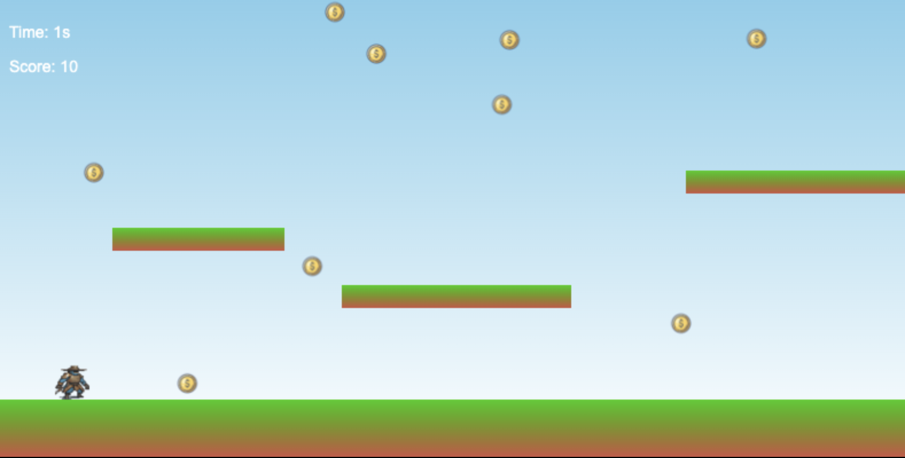

# Coin fever

A tiny game partially done with AI tools, as a way to experiment with them.
The game is a simple 2D platformer where the player collects coins.

- Music: [suno.ai](https://suno.com)
- Code scaffold and refactoring: [claude.ai](https://claude.ai)

## How to play

1. Open index.html in a browser.
2. Use the arrow keys to move the player.

